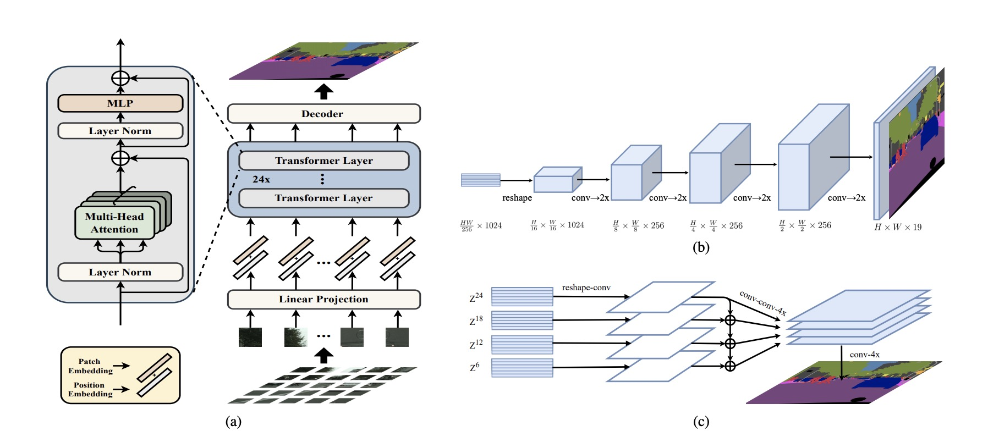

</img>

## SETR - Pytorch

Since the original paper (Rethinking Semantic Segmentation from a Sequence-to-Sequence Perspective with Transformers.) has no official code,I implemented SETR-Progressive UPsampling(SETR-PUP) using pytorch.

Original paper: <a href="https://arxiv.org/abs/2012.15840">Rethinking Semantic Segmentation from a Sequence-to-Sequence Perspective with Transformers.</a>

## Usage

```python
from SETR.transformer_seg import SETRModel
from SETR.transformer_model import TransConfig
import torch 

if __name__ == "__main__":
    net = SETRModel(img_size=(32, 32), 
                    in_channels=3, 
                    out_channels=1, 
                    hidden_size=1024, 
                    num_hidden_layers=8, 
                    num_attention_heads=16, 
                    decode_features=[512, 256, 128, 64])
    t1 = torch.rand(1, 3, 256, 256)
    print("input: " + str(t1.shape))
    
    # print(net)
    print("output: " + str(net(t1).shape))

```
If the output size is (1, 1, 256, 256), the code runs successfully.

## more
More examples will be updated later.